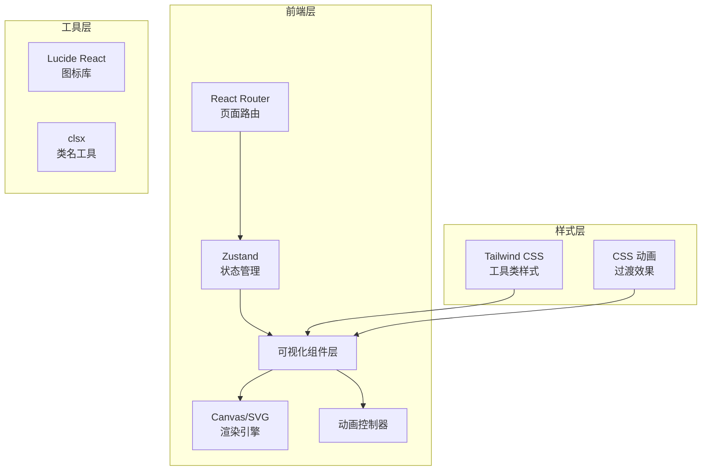

# 光电效应可视化平台 - 技术架构文档

## 1. 架构设计



## 2. 技术选型

| 技术 | 版本 | 用途 |
|-----|------|------|
| React | 18.x | UI框架 |
| TypeScript | 5.x | 类型安全 |
| Vite | 5.x | 构建工具 |
| Tailwind CSS | 3.x | 样式框架 |
| Zustand | 4.x | 状态管理 |
| React Router | 6.x | 页面路由 |
| Lucide React | 最新 | 图标库 |
| Framer Motion | 11.x | 动画库 |

## 3. 路由定义

| 路由 | 页面 | 描述 |
|-----|------|------|
| `/` | HomePage | 首页，模块入口 |
| `/interference` | InterferencePage | 光波干涉可视化 |
| `/mz-modulator` | MZModulatorPage | MZ调制器可视化 |
| `/iq-modulator` | IQModulatorPage | IQ调制器可视化 |
| `/polarization` | PolarizationPage | XY偏振复用可视化 |

## 4. 组件结构

```
src/
├── components/
│   ├── common/
│   │   ├── Navbar.tsx          # 顶部导航栏
│   │   ├── ModuleCard.tsx      # 模块卡片组件
│   │   ├── ControlPanel.tsx    # 参数控制面板
│   │   └── InfoTooltip.tsx    # 信息提示组件
│   ├── interference/
│   │   ├── WaveCanvas.tsx      # 干涉波动画
│   │   ├── IntensityChart.tsx  # 强度分布图
│   │   └── InterferenceSim.tsx # 干涉模拟器
│   ├── mz-modulator/
│   │   ├── MZStructure.tsx    # MZ结构图
│   │   ├── ModulationWave.tsx  # 调制波形
│   │   └── MZSimulator.tsx     # MZ模拟器
│   ├── iq-modulator/
│   │   ├── IQConstellation.tsx # IQ星座图
│   │   ├── IQVector.tsx        # IQ矢量图
│   │   ├── SignalWaveform.tsx  # 信号波形
│   │   └── IQSimulator.tsx     # IQ模拟器
│   └── polarization/
│       ├── StokesVector.tsx    # 斯托克斯矢量
│       ├── PolarizationState.tsx # 偏振态可视化
│       ├── DualChannel.tsx     # 双通道演示
│       └── PolarizationSim.tsx # 偏振复用模拟器
├── pages/
│   ├── HomePage.tsx
│   ├── InterferencePage.tsx
│   ├── MZModulatorPage.tsx
│   ├── IQModulatorPage.tsx
│   └── PolarizationPage.tsx
├── stores/
│   ├── useInterferenceStore.ts  # 干涉模块状态
│   ├── useMZStore.ts            # MZ模块状态
│   ├── useIQStore.ts            # IQ模块状态
│   └── usePolarizationStore.ts  # 偏振模块状态
├── hooks/
│   ├── useAnimationFrame.ts    # 动画帧钩子
│   ├── useCanvas.ts            # Canvas渲染钩子
│   └── useWaveCalculation.ts   # 光波计算钩子
├── utils/
│   ├── waveMath.ts             # 波动数学函数
│   ├── modulationMath.ts       # 调制数学函数
│   └── colors.ts               # 颜色配置
└── App.tsx
```

## 5. 状态管理设计

每个可视化模块都有独立的状态管理：

### 5.1 干涉模块状态 (useInterferenceStore)
```typescript
interface InterferenceState {
  wavelength: number;      // 波长 (nm)
  amplitude: number;       // 振幅
  phaseDiff: number;       // 相位差
  isPlaying: boolean;      // 播放状态
}
```

### 5.2 MZ调制器状态 (useMZStore)
```typescript
interface MZState {
  modulationDepth: number; // 调制深度 (0-1)
  phaseShift: number;      // 相位偏移
  inputPower: number;      // 输入功率
  armLengthDiff: number;   // 两臂长度差
}
```

### 5.3 IQ调制器状态 (useIQStore)
```typescript
interface IQState {
  modulationFormat: 'QPSK' | '16QAM' | '64QAM';
  symbolIndex: number;     // 当前符号索引
  iComponent: number;      // I分量
  qComponent: number;      // Q分量
}
```

### 5.4 偏振复用状态 (usePolarizationStore)
```typescript
interface PolarizationState {
  stokesS0: number;        // 斯托克斯S0
  stokesS1: number;        // 斯托克斯S1
  stokesS2: number;        // 斯托克斯S2
  stokesS3: number;        // 斯托克斯S3
  xPower: number;          // X通道功率
  yPower: number;          // Y通道功率
}
```

## 6. 核心数学函数

### 6.1 光波干涉
```
I = I1 + I2 + 2√(I1·I2)cos(Δφ)
Δφ = (2π/λ)·Δx + Δφ0
```

### 6.2 MZ调制器
```
E_out = E_in · cos(Δφ/2) · e^(i·Δφ/2)
输出功率: P_out = P_in · cos²(Δφ/2)
调制: Δφ = π·V/Vπ
```

### 6.3 IQ调制器
```
E_out = I·cos(ωt) + Q·sin(ωt)
     = A·cos(ωt - φ)
其中: A = √(I² + Q²), φ = arctan(Q/I)
```

### 6.4 斯托克斯矢量
```
S0 = Ex² + Ey²
S1 = Ex² - Ey²
S2 = 2·Ex·Ey·cos(δ)
S3 = 2·Ex·Ey·sin(δ)
偏振度: DOP = √(S1² + S2² + S3²) / S0
```

## 7. Canvas渲染策略

- 使用 `requestAnimationFrame` 实现60fps动画
- 波形使用 Path2D 对象缓存
- 复杂场景使用离屏Canvas预渲染
- 响应式Canvas尺寸调整

## 8. 性能优化

- 使用 `React.memo` 优化组件重渲染
- 状态更新使用不可变更新模式
- 动画计算使用 `useMemo` 缓存
- 大量元素使用虚拟化渲染

## 9. 部署方案

### 9.1 GitHub Pages 自动部署

项目使用 GitHub Actions 实现合并到 `main` 分支后自动构建并部署到 GitHub Pages。

#### 工作流配置
- **配置文件**: `.github/workflows/deploy.yml`
- **触发条件**: push 到 `main` 分支，或手动触发 (`workflow_dispatch`)
- **构建环境**: Ubuntu latest + Node.js 20 + pnpm 9

#### 部署流程


#### Vite 配置说明
- 构建时通过环境变量 `VITE_BASE_PATH` 设置 base 路径，值为仓库名 (`/仓库名/`)
- `vite.config.ts` 中需读取 `process.env.VITE_BASE_PATH || '/'` 作为 base 配置
- 确保 React Router 使用 `HashRouter` 或 `BrowserRouter` 配合正确的 basename

#### 仓库设置要求
在 GitHub 仓库 Settings → Pages 中：
- Source 选择 **GitHub Actions**
- 无需手动配置分支和目录，由 Actions 自动管理

### 9.2 构建产物

- 输出目录: `dist/`
- 包含静态 HTML、CSS、JS 和资源文件
- 构建命令: `pnpm build`
