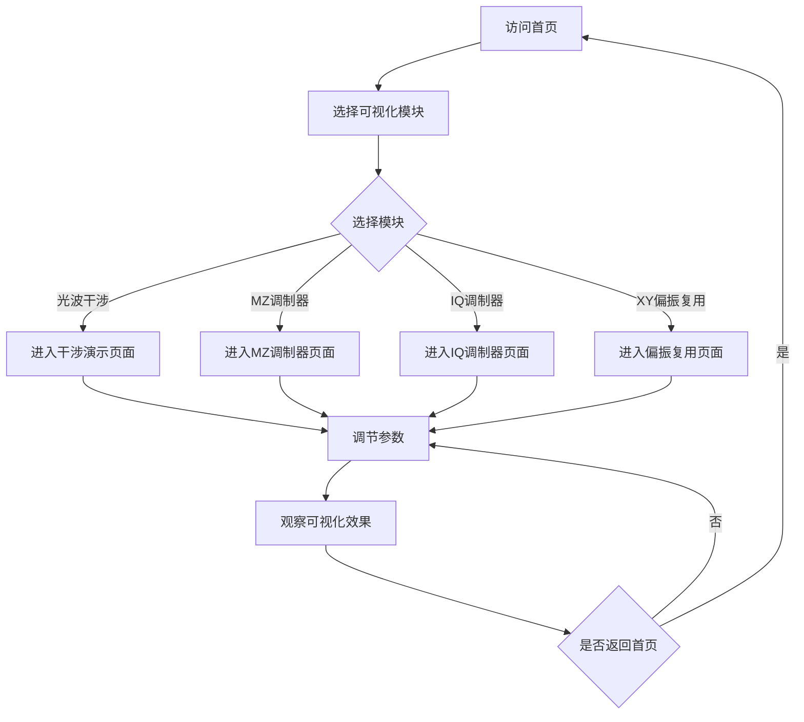

# 光电效应可视化平台 - 产品需求文档

## 1. 产品概述

光电效应可视化平台是一个基于Web的交互式科学可视化应用，专注于展示光电子器件的工作原理和调制技术。通过精美的动画和交互式演示，帮助用户深入理解光波干涉、马赫-曾德调制器、IQ调制器以及XY偏振复用等核心概念。

### 目标用户
- 光学工程、电子工程专业学生
- 光通信领域研究人员
- 对光电技术感兴趣的工程师和爱好者

### 核心价值
- 将抽象的光电效应原理可视化
- 通过交互式参数调节增强学习体验
- 提供直观的调制器工作流程演示

---

## 2. 功能模块

### 2.1 功能页面

| 页面名称 | 模块名称 | 功能描述 |
|---------|---------|---------|
| 首页 | 导航栏 | 简洁的顶部导航，包含Logo和页面链接 |
| 首页 | 概念介绍区 | 展示光电效应基本概念和研究意义 |
| 首页 | 可视化模块入口 | 四个主要可视化模块的卡片入口 |
| 光波干涉 | 干涉动画区 | 双缝干涉动画，实时显示光波叠加效果 |
| 光波干涉 | 参数控制面板 | 可调节波长、振幅、相位差 |
| 光波干涉 | 结果显示区 | 干涉图样和强度分布曲线 |
| MZ调制器 | 调制器结构图 | 马赫-曾德干涉仪结构可视化 |
| MZ调制器 | 工作原理动画 | 展示光信号调制过程 |
| MZ调制器 | 参数控制面板 | 可调节调制深度、相位偏移 |
| IQ调制器 | IQ星座图 | 16-QAM/64-QAM等调制格式可视化 |
| IQ调制器 | 矢量图演示 | I/Q分量的矢量表示 |
| IQ调制器 | 信号波形区 | 展示调制后的信号波形 |
| XY偏振复用 | 偏振态可视化 | 斯托克斯矢量可视化 |
| XY偏振复用 | 双通道演示 | X/Y偏振通道的独立调制展示 |
| XY偏振复用 | 复用/解复用动画 | 偏振复用与解复用过程 |

### 2.2 核心交互功能

1. **参数实时调节**：通过滑块控制光波参数，实时更新可视化效果
2. **动画播放控制**：播放、暂停、重置动画
3. **信息提示**：鼠标悬停显示专业术语解释
4. **响应式布局**：适配桌面端和移动端

---

## 3. 用户流程

### 3.1 主要用户路径

---

## 4. 用户界面设计

### 4.1 设计风格

**科技感深色主题**，灵感来源于光学实验室环境和光通信设备界面

- **主色调**：深蓝黑色 (`#0a0e17`) 模拟暗室环境
- **次要色**：深灰蓝 (`#1a2332`) 用于卡片和面板
- **强调色**：
  - 激光红 (`#ff3366`) 用于高能光波
  - 激光绿 (`#00ff88`) 用于信号指示
  - 激光蓝 (`#3366ff`) 用于中性光波
- **文字色**：白色 (`#ffffff`) 和浅灰 (`#94a3b8`)
- **边框/分隔线**：`#334155`

### 4.2 字体

- **标题字体**：`"Orbitron", "Rajdhani", sans-serif` - 科技感强
- **正文字体**：`"Inter", "Noto Sans SC", sans-serif` - 清晰易读
- **代码/数据字体**：`"JetBrains Mono", monospace`

### 4.3 按钮风格

- 圆角按钮 (`border-radius: 8px`)
- 悬停时有发光效果 (`box-shadow: 0 0 20px`)
- 激活状态有按压反馈

### 4.4 布局风格

- 卡片式布局展示各模块
- 网格系统布局 (`display: grid`)
- 大量留白，突出内容
- 左侧固定导航 + 右侧内容区

### 4.5 动画风格

- 流畅的页面切换过渡 (`300ms ease-out`)
- 光波动画使用平滑的正弦波运动
- 数据变化使用数字滚动效果
- 悬停效果使用微妙的缩放和发光

---

## 5. 视觉资产

### 5.1 图标风格
- 使用 Lucide React 图标库
- 线性风格，与科技感主题一致

### 5.2 装饰元素
- 背景网格线模拟光学平台
- 渐变光晕效果模拟光源
- 虚线模拟光路

---

## 6. 技术约束

- 纯前端实现，无需后端服务
- 支持现代浏览器 (Chrome, Firefox, Safari, Edge)
- 使用 Canvas 或 SVG 进行图形渲染
- 动画帧率保持在 60fps
